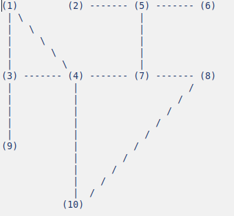

Eleicao de líder em ambiente wireless
===============

Para executar basta digitar (é necessário python3):

$ python3 eleicao.py

E digitar o id do nó e em seguida a capacidade do nó

# A topologia

